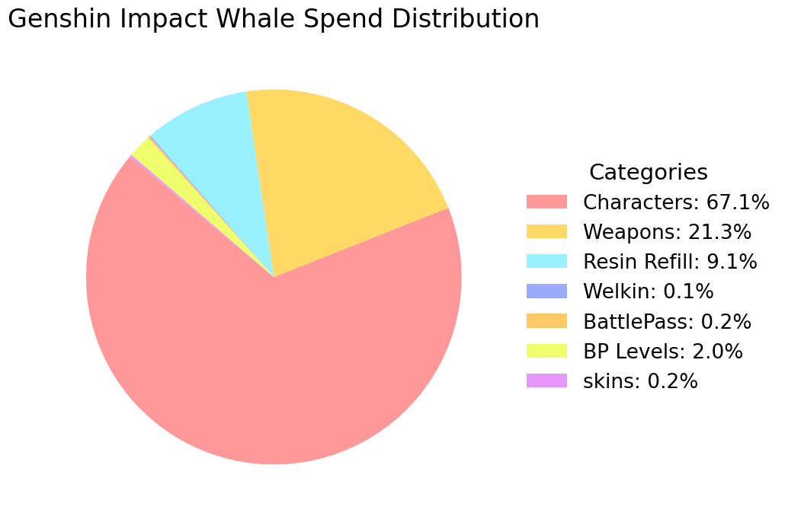

# Genshin Impact - Whale Calculator
This is a calculator that estimates how much a Genshin Impact whale can spend in the game.

To remove randomness and make the result deterministic, the calculator assumes worst-case luck:
- 180 pulls per 5★ character (guaranteed after losing the 50/50)
- 80 pulls per 5★ weapon

**Note:** 
For characters, losing the 50/50 is required to reach the deterministic cost.
For weapons, the model assumes a guaranteed limited 5★ weapon within the pity cycle and does not simulate additional losses.

**!!!** 
The result represents a theoretical maximum and deterministic cost, not an average or realistic outcome.

## Pie Spend Distribution

## Table Spend Distribution
| Type | Spend (EUR) | Spend (USD) | Share |
| :--- | :--- | :--- | :--- |
| All C6 characters | 159474.39 EUR | 186681.33 USD | 67.1% |
| All R5 weapons | 50652.55 EUR | 59294.07 USD | 21.3% |
| Welkin Moon | 289.87 EUR | 339.32 USD | 0.1% |
| Battle Pass | 409.63 EUR | 479.52 USD | 0.2% |
| Battle Pass Level Up | 4783.38 EUR | 5599.44 USD | 2.0% |
| Resin Refill | 21525.20 EUR | 25197.48 USD | 9.1% |
| All skins | 427.09 EUR | 499.95 USD | 0.2% |
| |
| **Total** | **237562.11 EUR** | **278091.11 USD** | **100%** |
